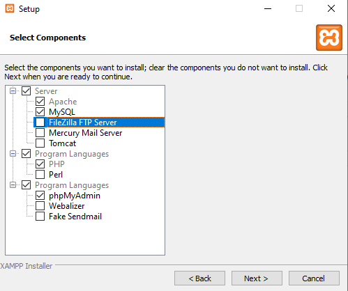
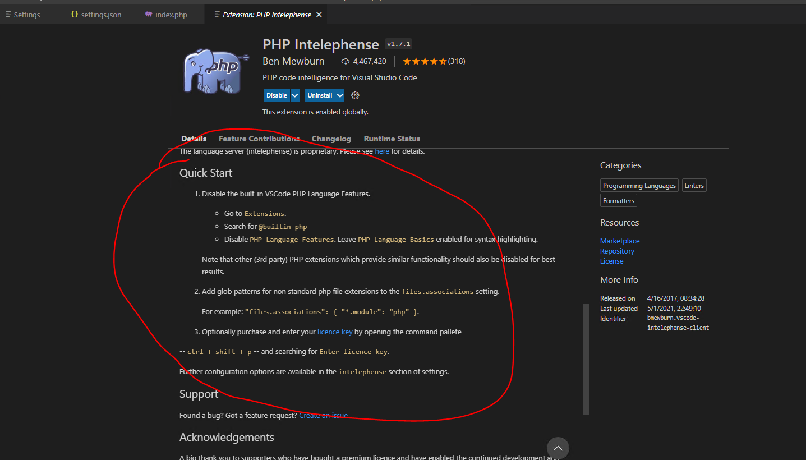
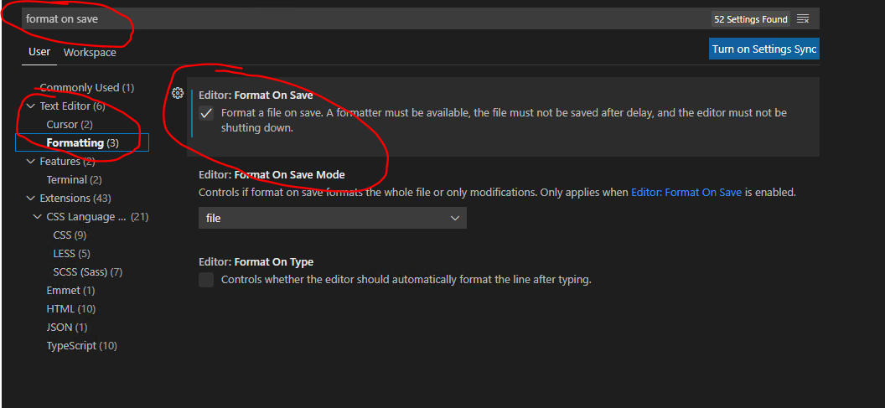

# Get Yer System Ready for a PHP Rodeo

## Overview

Time to move to server-side (aka back-end) development. It's pretty neat.

In order to get any work done in this second half of the course, you'll need to set up your dev environment.

If you don't do the stuff here sooner than later, you're basically flipping your future self the bird. Tell me how that works out for you, m'kay?

## Prerequisites

I'm assuming that you've:

- [ ] got VS Code installed
- [ ] somewhat recovered from the emotional trauma inflicted by the first half of the course

## A Video of SOME Usefulness

I made a screencast in the fall of 2020 for Randy's flock, detailing a lot of the following stuff - and more - for a Windows user. Naturally, versions have changed - and you may not have a Windows box - but there's still some useful stuff in here nonetheless.

Be my guest: https://youtu.be/aIENpQnpZy4 [41:24]

If you decide to look through the screencast, you should still read the following, especially if you decide to PHP Debug, as the settings configuration you need to do in the current version differs from what I show in the screencast.

## Instructions

### Installing XAMPP 

_To do our coursework, we need you to have some sort of [LAMP stack](https://en.wikipedia.org/wiki/LAMP_(software_bundle)) available. We'll be using XAMPP (technically pronounced "shamp"...but...really?!? We've always said "zamp") because it's free, been around forever, multiplatform, and always being improved & maintained. That being said, if you have another LAMP setup you're just dying to use, knock yourself out. (But I'm not helping you with any issues you have with it!)_

1. Go to the [Apache Friends](https://www.apachefriends.org/index.html) website and download the most recent version of the XAMPP installer for your OS.
2. Install that puppy:
   1. If you're on a Mac, you just get to drag an icon over to your Applications folder. Lucky you.
   2. If you're on a Linux box, I'm assuming you know what to do.
   3. If you're on Windows, you can _mostly_ accept the defaults, but I'd like to suggest these modifications:
      1. On the **Select Components** screen, deselect everything except Apache, MySQL, PHP, and phpMyAdmin. So it'll look like this:

      

      2. Uncheck the "Learn more about Bitnami for XAMPP" box at the **Bitnami for XAMPP** step.
      3. At the end of the install, when it gives you the option of starting the Control Panel, don't do it. You need to see how to do this manually.
      4. If you get Windows Firewall chirping about blocking access of anything, just choose "Allow access".
  

If you bump into any issues, take a look at [their forum](https://community.apachefriends.org/f/viewforum.php?f=34&sid=5fae797b1b5116f3716954e8ce842cb2) first. If you're still stuck, ping me. 

### Checking Your XAMPP Installation

Because we're paranoid souls, we should check that this whole installation thing worked.

#### Windows

> _If we don't do this next step first, exiting from the Control Panel becomes hella-annoying._

1. Tweak the shortcut to the **XAMPP Control Panel** in your Start Menu so that it runs in Admin mode:
   1. In the Start menu, right-click on **XAMPP Control Panel** and choose `More > Open file location`. This will open up Windows Explorer in the location where the shortcut lives.
   2. Right-click on the XAMPP Control Panel shortcut and choose `Properties`.
   3. In the Properties dialog, choose `Advanced`.
   4. In the resulting Advanced Properties dialog, check the `Run as administrator` box and click OK.
   5. Click OK to get out of the Properties dialog.
   

Now that **that's** over with, carry on:

2. Run your newly-Administratorfied **XAMPP Control Panel** shortcut from the Start menu.
3. Click the **Start** button for Apache - if you have any errors, see [this](https://youtu.be/aIENpQnpZy4?t=181).
4. Click the **Start** button for MySQL - if Windows Defender chirps in, just **Allow access**.
5. Click on the **Admin** button in the Apache row. Your default browser should open up on the "Welcome to XAMPP" page. This page is running locally on your system by the way - a lot like when you use Live Preview or Live Server in VS Code.

#### Linux

I got nothing for you, you hax0r, you.

#### Mac

1. Run XAMPP from your Applications.
2. On first start, some stuff happens - just ride the wave until it's done. 
3. When that's done, you'll have a control panel-y thing. You can click the **Start** button and wait for it to do that. 
   
    > _This took quite a while on the old Mac I have - you might get a faster response. Or not._

4. Click on the **Go to Application** button. This should start up your default browser and take you to a "Welcome to XAMPP" web page. This page is running locally on your system by the way - a lot like when you use Live Preview or Live Server in VS Code.

    > _This also took quite a while on the old Mac I have._

### Add Intelephense

This extension brings in PHP code completion, syntax highlighting, automated code formatting, and some other nice stuffs.

Look for `PHP Intelephense` by Ben Mewburn.

**Important**
On the extension page, there's a Quick Start section - **follow those steps...you CAN skip the file associate step if you wish, but don't skip the first step!**

I'd also suggest changing your settings so that you format files on save:

### Debugger (Optional, but...)

Not gonna lie to you: this is a pain. So if you want to debug things just with trace statements, you can....but man, it's nice to have a debugger, even if setting it up hurts a bit.

Your call.

If you want to go ahead, then:

1. Install the PHP Debug extension by Felix Becker
2. Follow the instructions under **Installation** for that extension - you have to follow them, or things won't work!

